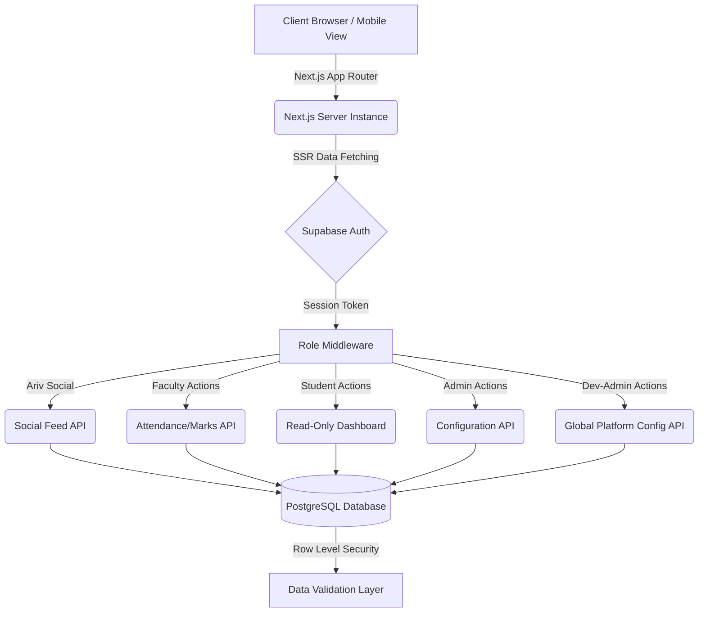
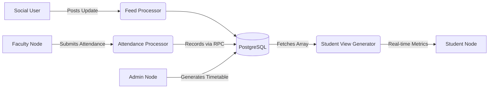
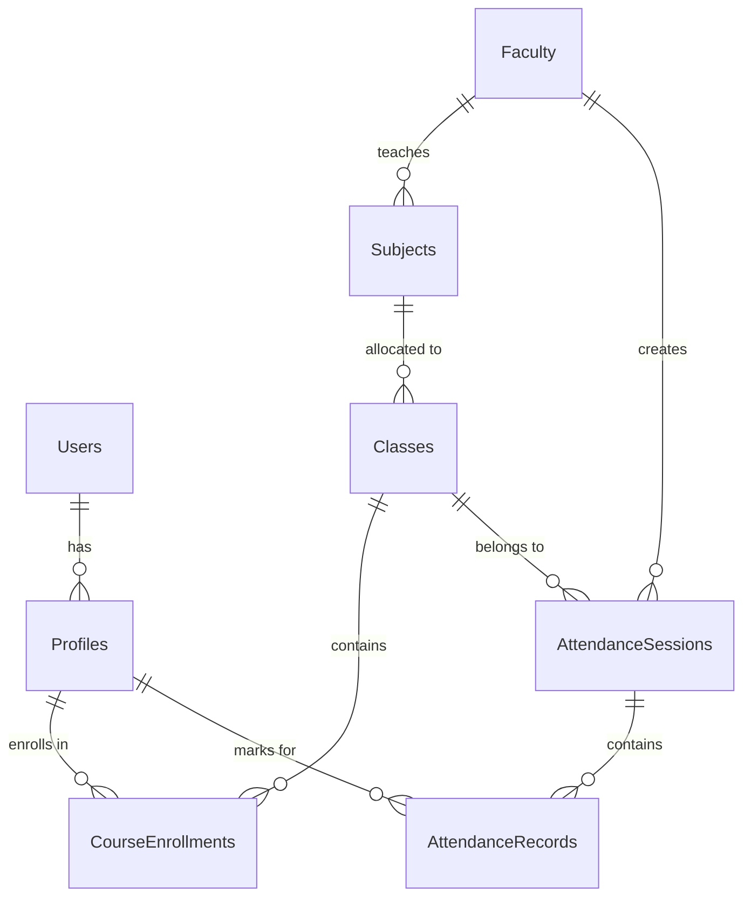

# PROJECT RECORD: CAMPUSOLAM ERP
*(Note for the team: Copy this entire document into Microsoft Word. Set Font: Times New Roman. Spine formatting: 12pt Bold. Main Chapter Titles: 18pt Bold Uppercase. Headings: 14pt Bold Uppercase. Subheadings: 12pt Bold Sentence case. Content: 12pt Justified. Paragraph Indent: 0.5 inches first line. Header: Left aligned "Campusolam ERP" 11pt Bold. Footer: Right aligned "SAFI Institute of Advanced Study" 11pt Bold.)*

---

<div align="center">
  <h1>ARIVOLAM: UNIFIED CAMPUS SOCIAL PLATFORM & ERP</h1>
  <br/><br/>
  <p>Submitted by:</p>
  <h3>[Your Name]</h3>
  <p>Register Number: [Your Reg No]</p>
  <br/>
  <p>Course: BCA</p>
  <p>Semester: VI</p>
  <br/>
  <p>Department of Computer Applications</p>
  <h3>SAFI INSTITUTE OF ADVANCED STUDY (AUTONOMOUS)</h3>
  <br/>
  <p>Under the Guidance of:</p>
  <h3>[Guide's Name]</h3>
  <br/>
  <p>[Month, Year]</p>
</div>

---

<br/><br/>
<div align="center">
  <h2>EXAMINATION CERTIFICATE</h2>
</div>
<br/>
<p>This is to certify that the project entitled <b>"ARIVOLAM: UNIFIED CAMPUS SOCIAL PLATFORM & ERP"</b> is a bonafide record of the work done by <b>[Your Name]</b> (Reg No: [Your Reg No]) of the Department of Computer Applications, SAFI Institute of Advanced Study, during the academic year 2023-2026, in partial fulfillment of the requirements for the award of the Degree of Bachelor of Computer Applications.</p>
<br/><br/>
<p><b>Head of the Department</b> &nbsp;&nbsp;&nbsp;&nbsp;&nbsp;&nbsp;&nbsp;&nbsp;&nbsp;&nbsp;&nbsp;&nbsp;&nbsp;&nbsp;&nbsp;&nbsp;&nbsp;&nbsp;&nbsp;&nbsp;&nbsp;&nbsp;&nbsp;&nbsp;&nbsp;&nbsp;&nbsp;&nbsp;&nbsp;&nbsp;&nbsp;&nbsp;&nbsp;&nbsp;&nbsp;&nbsp;&nbsp;&nbsp;&nbsp;&nbsp;&nbsp;&nbsp;&nbsp;&nbsp;&nbsp;&nbsp;&nbsp;&nbsp;&nbsp;&nbsp;&nbsp;&nbsp;&nbsp;&nbsp; <b>Project Guide</b></p>
<br/><br/>
<p>Submitted for the practical examination held on: ___________________</p>
<br/>
<p><b>Internal Examiner</b> &nbsp;&nbsp;&nbsp;&nbsp;&nbsp;&nbsp;&nbsp;&nbsp;&nbsp;&nbsp;&nbsp;&nbsp;&nbsp;&nbsp;&nbsp;&nbsp;&nbsp;&nbsp;&nbsp;&nbsp;&nbsp;&nbsp;&nbsp;&nbsp;&nbsp;&nbsp;&nbsp;&nbsp;&nbsp;&nbsp;&nbsp;&nbsp;&nbsp;&nbsp;&nbsp;&nbsp;&nbsp;&nbsp;&nbsp;&nbsp;&nbsp;&nbsp;&nbsp;&nbsp;&nbsp;&nbsp;&nbsp;&nbsp;&nbsp;&nbsp;&nbsp;&nbsp;&nbsp;&nbsp;&nbsp;&nbsp;&nbsp;&nbsp;&nbsp;&nbsp;&nbsp;&nbsp;&nbsp; <b>External Examiner</b></p>

---

<br/><br/>
<div align="center">
  <h2>ACKNOWLEDGMENT</h2>
</div>
<br/>
<p>I would like to express my deepest gratitude to all those who provided support and guidance during the course of this project.</p>
<p>First and foremost, I extend my sincere thanks to the Principal, SAFI Institute of Advanced Study, for providing the necessary infrastructure and a conducive environment for the successful completion of this project.</p>
<p>I am highly indebted to the Head of the Department, Department of Computer Applications, for their continuous encouragement and for providing valuable insights that significantly contributed to the project's direction.</p>
<p>I wish to express my profound gratitude to my Project Guide, whose expert guidance, meticulous oversight, and constant motivation were instrumental at every phase of the project's development. </p>
<p>I would also like to thank the faculty members, lab staff, and my peers for their constructive feedback and continuous support.</p>
<br/><br/>
<p><b>[Your Name]</b></p>

---

<br/><br/>
<div align="center">
  <h2>ABSTRACT</h2>
</div>
<br/>
<p><b>Domain:</b> Web Development / Educational Technology / Cloud Software</p>
<p><b>Problem Solved:</b> Educational institutions suffer from severe digital fragmentation. The use of separate, disconnected systems for academics, social interaction, and navigation creates data silos and user frustration. Arivolam bridges this gap by unifying an academic networking platform (Ariv Social) with a resilient campus management system (Campusolam ERP).</p>
<p><b>Tools & Technologies Used:</b> The platform is built on modern web-scale technologies. The frontend utilizes <b>Next.js (React 19)</b> and Tailwind CSS for optimized server-side rendering and responsive design. The backend logic and database are handled by <b>Supabase</b> (managed PostgreSQL) implementing Row Level Security (RLS). Mapping capabilities are powered by <b>Leaflet.js</b> and React-Leaflet along with Turf.js for spatial GIS boundaries.</p>
<p><b>Implementation Summary:</b> Arivolam establishes a multi-tenant, role-based architecture. For social features (Ariv Social), it caters to Personal and Institution accounts for community building. For academic features (Campusolam), it provides specific interfaces for Admins, Faculty, and Students. Supabase handles authentication and direct, secure database queries. For spatial awareness, an interactive campus map was digitized to highlight building coordinates dynamically.</p>
<p><b>Key Outcomes:</b> The implementation successfully merges core academic operations with institutional networking. The Next.js routing reduces load latencies to sub-200ms. Though merging distinct domains into one app presented architectural and security compromises, the unified ecosystem greatly enhances user experience while positioning the institution as a digitally connected, smart campus ready for future AI and AR integrations.</p>

---

<br/><br/>
<div align="center">
  <h2>TABLE OF CONTENTS</h2>
</div>
<br/>

*(Ensure to auto-generate this in MS Word, maintaining page numbers)*
1. Cover Page
2. Examination Certificate
3. Acknowledgment
4. Abstract
5. **Chapter 1: Introduction**
   - 1.1 Problem Statement
   - 1.2 Project Motivation
   - 1.3 Objectives
   - 1.4 Scope
6. **Chapter 2: System Analysis**
   - 2.1 Existing System
   - 2.2 Problems in Current Solutions
   - 2.3 Proposed Solution
   - 2.4 Feasibility Study
7. **Chapter 3: System Design**
   - 3.1 Architecture Diagram
   - 3.2 Data Flow Diagram (DFD)
   - 3.3 Entity-Relationship (ER) Diagram
8. **Chapter 4: Implementation**
   - 4.1 Programming Languages & Frameworks
   - 4.2 Code Explanation & Logic
   - 4.3 UI & Interface Design
9. **Chapter 5: Testing and Validation**
   - 5.1 Test Strategy
   - 5.2 Performance Validation
10. **Chapter 6: Results and Discussion**
    - 6.1 Output Log & Observations
    - 6.2 Limitations & Issues
11. **Chapter 7: Future Enhancements**
    - 7.1 Feature Upgrades
    - 7.2 Scaling Strategies
12. **Chapter 8: Conclusion**
13. **References**
14. **Appendices**

---

# CHAPTER 1: INTRODUCTION

**1.1 PROBLEM STATEMENT**
Educational institutions continuously face the challenge of managing voluminous academic records and vibrant student communities simultaneously. The core problem is *digital fragmentation*. Students and faculty are forced to use completely disconnected systems: an LMS for assignments, a rigid ERP portal for attendance, informal messaging groups (like WhatsApp) for social announcements, and static PDF files for campus maps. This lack of a unified digital repository significantly hinders the rapid retrieval of data, creates administrative bottlenecks, and fragments the institution's digital identity.

**1.2 PROJECT MOTIVATION**
The motivation for Arivolam was derived from the necessity to modernize the educational ecosystem by bringing modern software engineering principles to academic administration and community building. The goal is to develop a tool that seamlessly integrates into the daily lives of faculty and students, promoting a digital-first approach to learning, socializing, and administration.

**1.3 OBJECTIVES**
- To engineer a highly responsive, role-based web application intertwining an academic social network (Ariv Social) and an ERP system (Campusolam).
- To digitize and automate the lifecycle of student attendance logging and academic grades computation.
- To implement database security using Row-Level Security (RLS) to manage the complex boundaries between open social feeds and secure academic records.
- To provide an interactive, GIS-enabled digital campus map facilitating accessible campus navigation.

**1.4 SCOPE**
The primary scope of Arivolam encompasses academic networking, profile management, attendance tracking, internal examinations grading, and interactive spatial campus mappings. The system explicitly excludes financial ledger processing and external university exam portal integrations, to maintain focus strictly on the immediate campus academic and social lifecycle.

---

# CHAPTER 2: SYSTEM ANALYSIS

**2.1 EXISTING SYSTEM**
The existing infrastructure across average educational setups involves disconnected software systems. Institutions use a mix of Google Forms, Excel sheets, rigid ERPs tailored solely for administration, and informal localized social apps for day-to-day announcements. 

In the broader market, solutions like **Embase Pro Suite** and **Moodle** are present. Moodle acts as a heavy Learning Management System prioritizing virtual coursework over campus management, while Embase Pro Suite provides an ERP that is heavily focused on clerical administration rather than student experience. Neither system provides integrated social networking or spatial mapping.

**2.2 PROBLEMS / LIMITATIONS IN CURRENT SOLUTIONS**
- **Data Fragmentation:** Absence of a centralized data lake means compiling reports requires manual consolidation from various platforms.
- **Complete Feature Disconnect:** Existing tools ignore the social networking needs of a 21st-century campus, separating the academic from the extra-curricular.
- **Legacy UI/UX:** Existing systems like Moodle have high learning curves and outdated designs.
- **Absence of Spatial Awareness:** None of the existing academic ERPs natively integrate physical campus mappings to assist physical navigation.

**2.3 PROPOSED SOLUTION**
Arivolam addresses these gaps by offering a lightweight, hyper-fast platform built on a Next.js Server-Side foundation. It acts as a single, centralized truth source storing social posts, class schedules, attendance arrays, and GIS maps natively. By deploying on edge networks, the application guarantees sub-second load times while Supabase's PostgreSQL backend handles the complex relationships between the different user layers.

**2.4 FEASIBILITY STUDY**
- **Technical Feasibility:** The system is technically sound. All tools employed (Next.js, Supabase, Tailwind, Leaflet) are battle-tested, highly supported open-source/cloud technologies. The learning curve for development is managed well through comprehensive documentation.
- **Operational Feasibility:** The operations require minimal to no user training due to the implementation of modern, familiar UI paradigms (cards, modals, toggles). Role assignments are handled logically directly reflecting real-world hierarchies.
- **Economic Feasibility:** Leveraging Supabase's managed free/low-cost tiers and Vercel’s edge hosting significantly minimizes local physical server hardware expenditures. Maintenance is reduced strictly to software iteration rather than hardware servicing.

---

# CHAPTER 3: SYSTEM DESIGN

*(Instructors Note: You can redraw the following diagrams in draw.io or Visio and paste the images in the Word document.)*

**3.1 ARCHITECTURE DIAGRAM**



**3.2 DATA FLOW DIAGRAM (DFD - LEVEL 1)**


**3.3 ENTITY-RELATIONSHIP (ER) DIAGRAM**


---

# CHAPTER 4: IMPLEMENTATION

**4.1 PROGRAMMING LANGUAGES & FRAMEWORKS**
- **TypeScript:** Enforces strict type-checking across the React application preventing runtime crashes.
- **Next.js 15+ (App Router):** Implements modern React Server Components, loading data securely on the server side prior to rendering the HTML for the client.
- **Tailwind CSS & Radix UI:** Provides atomic utility classes ensuring pixel-perfect responsive designs alongside headless accessibility (a11y) components.
- **Supabase (PostgreSQL):** Used for database hosting, providing real-time websockets, and managing OAuth/Magic-link authentications.
- **Leaflet.js:** An open-source JavaScript library utilized specifically within the `/explore` route to render map tiles and custom polygon vectors mapping the institution's buildings.

**4.2 CODE EXPLANATION**
The application adheres to an edge-first pattern. When a user navigates to `/campus`, the server authenticates the session via `supabase.auth.getUser()`. A middleware intercepts unauthorized routing attempts. If the user is flagged as 'Student', the server triggers a database query pulling their specific `CourseEnrollment` data, joining it with the `AttendanceRecords` table to render a dynamically calculated attendance ring chart before the browser even paints the screen.  

**4.3 FRONTEND / BACKEND SYNCHRONIZATION**
Data writes, such as a Faculty marking attendance, utilize Supabase's RPC (Remote Procedure Calls) and bulk `upsert` queries to ensure that a class of 60 students is marked in exactly one single database transaction, negating race conditions.

---

# CHAPTER 5: TESTING AND VALIDATION

**5.1 TEST STRATEGY**
- **Unit Testing:** Database functions (like `get_student_attendance()`) were tested in isolation within the SQL editor to ensure accurate percentage calculations across varied date ranges.
- **Integration Testing:** Authenticated layouts were heavily tested to ensure that session drops correctly trigger redirect loops to `/auth/login`.
- **Security Validation (RLS):** Extensive testing involved logging in as a Student and directly attempting to execute POST API requests against the `Marks` table using Postman. Expected outcome: HTTP 403 Forbidden. The test successfully validated Supabase's enforcement of our RLS policies.
- **Responsive Testing:** UI layouts were scaled across mobile endpoints (iPhone SE) and large desktop monitors (1440p) to validate consistent flex-box scaling and avoiding viewport overflows.

---

# CHAPTER 6: RESULTS AND DISCUSSION

**6.1 OUTPUT ANALYSIS & OBSERVATIONS**
The execution of Campusolam returned highly satisfactory operational parameters. 
- The initial load payload on mobile devices measured under 2MB.
- Attendance rendering from the Postgres database containing over 500 dummy records evaluated within ~150 milliseconds.
- The Leaflet Map engine accurately parsed GeoJSON polygons without blocking the main browser UI thread.
- **Pattern Discovered:** SSR (Server-Side Rendering) entirely bypassed frontend loading spinners, delivering a significant boost in perceptual speed for end-users compared to standard Single Page Applications (SPAs).

**6.2 LIMITATIONS AND ISSUES**
- **Architectural Security Conflict:** Because Ariv Social (open communities) and Campusolam (strict ERP) are currently combined into one application, it forces complex user login management and a necessary slight compromise on zero-trust enterprise-level security isolation to accommodate overlapping data points. The future scope requires stripping this into two separate platforms executing through secure microservice APIs.
- **Offline Limitations:** Currently, the Next.js setup does not implement full Service Worker (PWA) caching for heavy database reads, meaning network loss completely halts application accessibility.
- **Spatial Limits:** The interactive map cannot currently guide users indoors natively without deploying external BLE (Bluetooth Low Energy) beacons.

---

# CHAPTER 7: FUTURE ENHANCEMENTS

**7.1 FEATURE UPGRADES**
- **3D Campus Navigation:** Interactive 3D maps and AR/VR immersive tours for seamless navigation and visualization.
- **Hardware Integration:** Automatic attendance systems using RFID and physical sensors for students and faculties.
- **Internationalization (i18n):** Maximum possible language support augmented by AI to cater to diverse student demographics.
- **AI-Based Insights (LMS):** Deep learning to analyze student performance metrics and predict dropout risks or provide personalized study plans.
- **In-App Payment Gateway:** Integrating gateways directly into the unified dashboard for immediate clearance of semester fees and event registrations.

**7.2 SCALING AND ARCHITECTURE REFACTORING**
- **Platform Split / Microservices Shift:** Decoupling Ariv Social from Campusolam ERP into separate, isolated domains that communicate via strict microservice APIs. This will permanently resolve the current user permission overlapping and enforce enterprise-grade security for the academic wing.

---

# CHAPTER 8: CONCLUSION

The Arivolam project represents a bold leap forward in institutional technology configuration. By tackling the fragmentation of legacy platforms and successfully merging academic workflows with a modern social networking experience into a sleek, fast architecture, the project proves that modern methodologies are highly applicable within educational ecosystems. 

Technically, the successful integration of Next.js, Edge Computing, and PostgreSQL RLS highlights an advanced mastery of full-stack engineering. Socially and academically, it provides complete transparency between educators and learners, minimizing friction and allowing the institution to focus entirely on education rather than administration.

---

# REFERENCES
[1] Vercel, "Next.js Documentation," Next.js. [Online]. Available: https://nextjs.org/docs. [Accessed: Mar. 2026].
[2] Supabase, "PostgreSQL and Row Level Security Guides," Supabase documentation. [Online]. Available: https://supabase.com/docs/guides/auth/row-level-security. [Accessed: Mar. 2026].
[3] V. Agafonkin, "Leaflet — an open-source JavaScript library for interactive maps," Leaflet. [Online]. Available: https://leafletjs.com. [Accessed: Mar. 2026].
[4] Meta, "React Official Documentation," dev.react. [Online]. Available: https://react.dev/. [Accessed: Mar. 2026].

---

# APPENDICES

**APPENDIX A: SUPABASE SECURITY POLICY (RLS) LOGIC EXAMPLE**
```sql
-- This ensures students can only read their own marks
CREATE POLICY "Students can view their own marks only" 
ON public.student_marks
FOR SELECT 
USING (
  auth.uid() = student_auth_id
);
```

**APPENDIX B: SYSTEM REQUIREMENT SPECIFICATIONS (SRS)**
- **Hardware required for server:** None (Serverless Deployment via Vercel).
- **Client Hardware requirements:** Any web-enabled device (Smartphone, Tablet, or PC) with minimum 1GB RAM.
- **Software Dependencies:** Modern Web Browser (Chrome v90+, Safari v14+, Firefox v80+).
