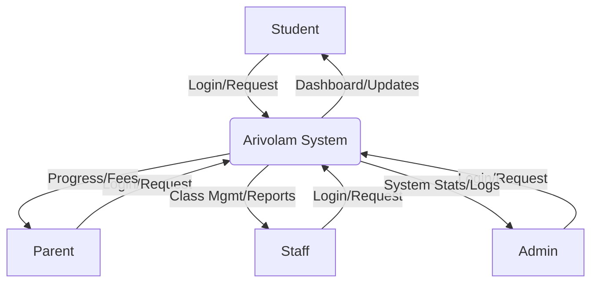
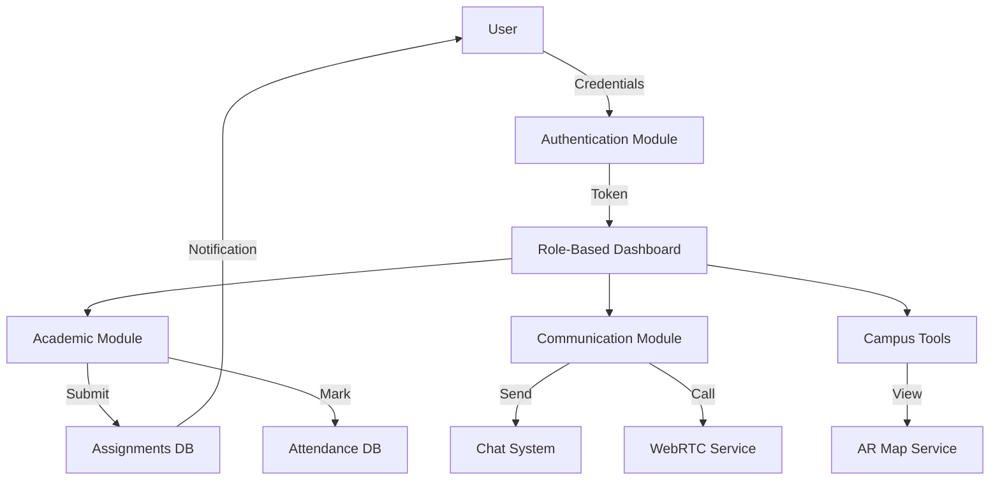
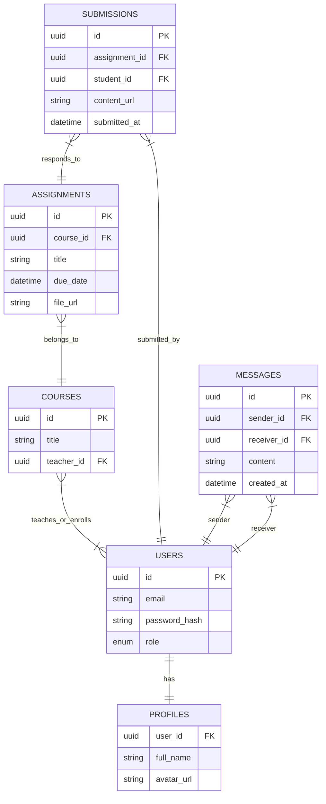

# System Diagrams

## Data Flow Diagrams (DFD)

### Level 0: Context Diagram

```mermaid
graph TD
    S[Student] -->|Login/Request| SYS(Arivolam System)
    P[Parent] -->|Login/Request| SYS
    T[Staff] -->|Login/Request| SYS
    A[Admin] -->|Login/Request| SYS
    
    SYS -->|Dashboard/Updates| S
    SYS -->|Progress/Fees| P
    SYS -->|Class Mgmt/Reports| T
    SYS -->|System Stats/Logs| A
```

### Level 1: System Overview

```mermaid
graph TD
    User[User] -->|Credentials| Auth[Authentication Module]
    Auth -->|Token| Dashboard[Role-Based Dashboard]
    
    Dashboard --> Academics[Academic Module]
    Dashboard --> Comms[Communication Module]
    Dashboard --> Campus[Campus Tools]
    
    Academics -->|Submit| Assign[Assignments DB]
    Academics -->|Mark| Attend[Attendance DB]
    
    Comms -->|Send| Chat[Chat System]
    Comms -->|Call| Video[WebRTC Service]
    
    Campus -->|View| Map[AR Map Service]
    
    Assign -->|Notification| User
```

## Entity Relationship Diagram (ERD)

```mermaid
erDiagram
    USERS ||--|| PROFILES : has
    USERS {
        uuid id PK
        string email
        string password_hash
        enum role
    }
    PROFILES {
        uuid user_id FK
        string full_name
        string avatar_url
    }
    
    COURSES }|--|{ USERS : teaches_or_enrolls
    COURSES {
        uuid id PK
        string title
        uuid teacher_id FK
    }
    
    ASSIGNMENTS }|--|| COURSES : belongs_to
    ASSIGNMENTS {
        uuid id PK
        uuid course_id FK
        string title
        datetime due_date
        string file_url
    }
    
    SUBMISSIONS }|--|| ASSIGNMENTS : responds_to
    SUBMISSIONS }|--|| USERS : submitted_by
    SUBMISSIONS {
        uuid id PK
        uuid assignment_id FK
        uuid student_id FK
        string content_url
        datetime submitted_at
    }
    
    MESSAGES }|--|| USERS : sender
    MESSAGES }|--|| USERS : receiver
    MESSAGES {
        uuid id PK
        uuid sender_id FK
        uuid receiver_id FK
        string content
        datetime created_at
    }
```
